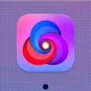
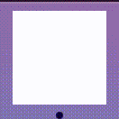

# AutomaticDockTile

A day after the Big Sur release, I've noticed that the icon of [Nova](https://nova.app) by [Panic](https://panic.com) changes colors when switching between light and dark mode. **Here's how it looks like:**  

I [tweeted](https://twitter.com/destroystokyo/status/1327224712578142209) about it immediately, and few hours later looked up how to do this. There were no results about it, so I started tinkering around. I examined all of the `.car`'s and `.icns`'s, but there was nothing. So I checked how to update the dock icon and I've stumbled upon [NSDockTilePlugin](https://developer.apple.com/documentation/appkit/nsdocktileplugin) - bingo!

Unfortunately, it wasn't *that* easy - there's not much documentation on how to use it, but there's [one example project](https://github.com/CartBlanche/MacDockTileSample). It's in Objective-C (which I've never used) though - not optimal, but I can work with that.

After around two hours I've managed to successfully register the Swift-based plugin (**protip:** create new bundle, set the principal class and register the plugin in the host app with `NSDockTilePlugIn`. If something isn't working, console is your best friend). Now, let's do the theme-changing part.

While reverse-engineering the `NovaDockTile` plugin I saw some observer-related code. Basic publisher for `NSApp.effectiveAppearance` did the job just fine.

Ta-da! Icon's updating on theme change ✨.  

